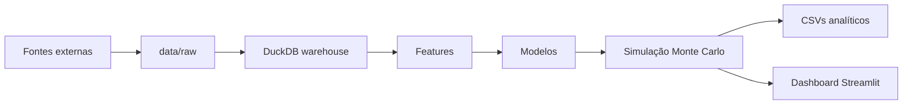

# World Cup Probability

Projeto Python para estimar probabilidades da Copa do Mundo de 2026 a partir de
dados históricos de seleções, rankings, ratings Elo, atributos de elenco e
simulações Monte Carlo.

O repositório organiza um pipeline local que baixa e carrega dados, constrói
features, treina modelos, simula o torneio oficial de 2026 e publica resultados
em um dashboard Streamlit.

## O que o projeto entrega

- Warehouse analítico local em DuckDB.
- Histórico Elo próprio do projeto, calculado sobre partidas internacionais.
- Integração com snapshots de World Football Elo Ratings e FIFA World Ranking.
- Features de forma recente, força relativa, histórico de Copa e atributos de
  elenco.
- Modelo XGBoost Poisson para intensidade de gols.
- Modelo XGBoost categórico para vitória, empate ou derrota.
- Simulação Monte Carlo da Copa de 2026 com fase de grupos, terceiros colocados,
  mata-mata, disputa de terceiro lugar e final.
- Exportação de CSVs analíticos e dashboard Streamlit para explorar previsões e
  avaliar jogos reais conforme placares forem preenchidos.

## Estrutura

```text
config/      Manifestos de fontes opcionais, como FBref e Transfermarkt.
data/        Dados brutos e warehouse DuckDB local.
docs/        Documentação técnica e guia de execução.
models/      Modelos treinados e métricas geradas pelo pipeline.
reports/     Figuras, CSVs analíticos e artefatos de relatório.
src/         Código do pipeline, modelos, simulação e dashboard.
tests/       Testes automatizados.
```

## Fluxo de dados



## Principais fontes

- Kaggle: partidas internacionais e atributos de jogadores/elencos.
- FBref: estatísticas opcionais por liga e temporada.
- Transfermarkt: valores de mercado por seleção a partir de manifesto local.
- The Fjelstul World Cup Database: histórico de Copas e disciplina.
- World Football Elo Ratings: snapshot global atual.
- FIFA World Ranking: snapshot masculino atual.

As fontes de rede podem exigir credenciais, licença aceita previamente ou
disponibilidade do site no momento da coleta. O projeto mantém fallbacks para que
algumas features opcionais não impeçam a execução quando uma fonte ainda não foi
carregada.

## Como rodar

Use Python 3.12 e `uv`.

```powershell
uv sync
uv run pytest
```

O guia completo de execução fica em [docs/como_rodar.md](docs/como_rodar.md). Ele
mostra a ordem recomendada do pipeline e como executar cada comando publicado no
`pyproject.toml`.

Atalho para uma execução local pequena, assumindo dados brutos já disponíveis:

```powershell
uv run load-data
uv run pipeline --iterations 1000 --batch-size 250 --seed 42
uv run update-world-cup-results
uv run dashboard
```

## Artefatos principais

- `data/warehouse/world_cup.duckdb`: banco analítico local.
- `models/xgb_poisson_model.json`: modelo de gols.
- `models/xgb_outcome_model.json`: modelo de vitória, empate e derrota.
- `models/xgb_outcome_metrics.json`: métricas de validação do modelo categórico.
- `models/xgb_outcome_calibration.json`: calibração das probabilidades V/E/D.
- `models/world_cup_2026_holdout_metrics.json`: avaliação de holdout da Copa de
  2026 quando houver jogos pontuados.
- `reports/figures/xgb_poisson_beeswarm.png`: explicabilidade SHAP do modelo de
  gols.
- `reports/analytics/*.csv`: resumos de semifinal, título e final mais provável.
- `data/raw/fifa/world_cup_2026_results.json`: cache local dos placares reais
  buscados pela ação `uv run update-world-cup-results` e pelo dashboard.

## Documentação

- [Como rodar o projeto](docs/como_rodar.md)
- [Modelo Elo](docs/01_modelo_elo.md)
- [Schema DuckDB](docs/02_schema_duckdb.md)
- [Distribuição Poisson](docs/03_poisson_dist.md)

## Qualidade

```powershell
uv run ruff format
uv run ruff check --fix
uv run sqlfluff lint src/sql
uv run pytest
```

Hooks locais:

```powershell
uv run pre-commit install
uv run pre-commit install --hook-type pre-push
```
